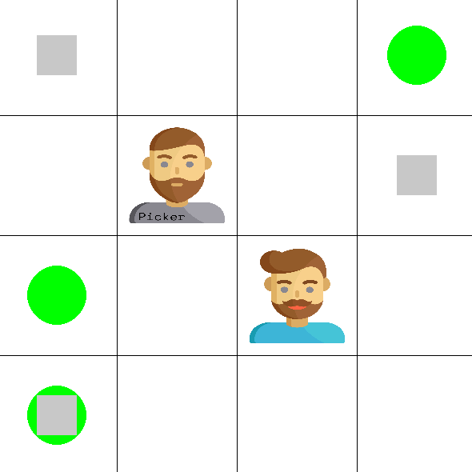

<p align="center">
 
 <p align="center">A multi-agent reinforcement learning environment</p>
</p>

<!-- TABLE OF CONTENTS -->
<h1> Table of Contents </h1>

- [Overview](#overview)
- [Getting Started](#getting-started)
  - [Installation](#installation)
- [Usage](#usage)
  - [Action Space](#action-space)
  - [Observation Space](#observation-space)
  - [Rewards](#rewards)
- [Please Cite](#please-cite)
- [Contributing](#contributing)
- [Contact](#contact)

<!-- OVERVIEW -->
# Overview

In the Collaborative Pick and Place environment, multiple agents collaborate in a grid-based world to achieve a common objective. Their mission is to efficiently pick up and place objects (green circles) into designated goal positions (gray rectangles). Agents are divided into two categories:

- **Pickers**: These agents can automatically collect objects while traversing the grid but cannot place them in goal positions.

- **Non-pickers**: In contrast, non-picker agents can deposit objects into goal positions upon reaching them but cannot pick up objects from the grid.

Success in this task relies on the agents' ability to develop a collaborative strategy. Agents can perform movements in four cardinal directions (up, down, left, right) and have the option to wait in their current position. They can also engage in collaboration by using the 'PASS' action to transfer objects between adjacent agents. Successful object placement in goal positions results in rewards for the agents, and the task is considered complete when all objects are in their designated goal positions.

<!-- GETTING STARTED -->
# Getting Started

## Installation

You can install the Collaborative Pick and Place environment using pip:

```sh
pip install collaborative-pick-place

