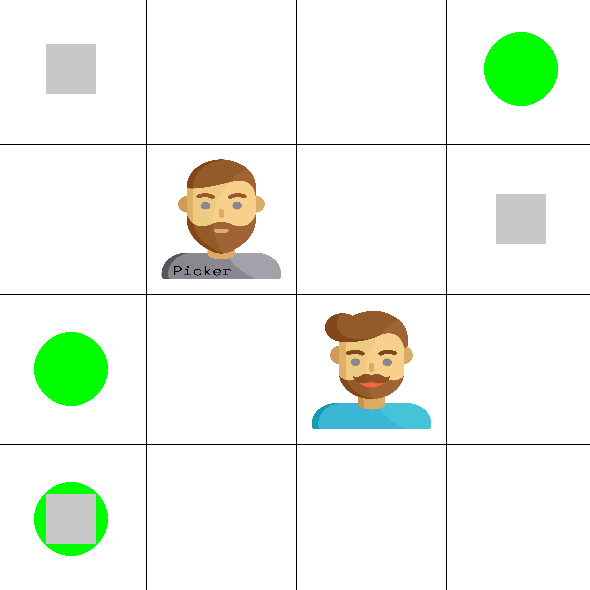

<p align="center">
  <strong>Collaborative Pick and Place</strong>
</p>

<p align="center">
  
</p>

<p align="center">
  A multi-agent reinforcement learning environment
</p>

<!-- TABLE OF CONTENTS -->

## Table of Contents

- [Overview](#overview)
- [Getting Started](#getting-started)
- [Usage](#usage)
  - [Action Space](#action-space)
  - [Observation Space](#observation-space)
  - [Rewards](#rewards)
- [Interactive Mode](#interactive-mode)
- [Contributing](#contributing)
- [Contact](#contact)

<!-- OVERVIEW -->

## Overview

A Gym-compatible grid-world environment for multi-agent reinforcement learning (MARL). Agents must collaboratively pick up boxes and place them at designated goal positions.

Agents are divided into two roles:
- **Pickers** can pick up boxes but cannot place them at goals.
- **Droppers** can place boxes at goals but cannot pick them up.

To complete the task, Pickers must pass boxes to Droppers, who then carry them to goal positions. The environment supports four movement directions, a wait action, and a pass action for transferring boxes between adjacent agents. Unfilled goals are shown with red borders; filled goals turn green.

## Getting Started

### Installation

```sh
git clone https://github.com/gmontana/CollaborativePickAndPlaceEnv
cd CollaborativePickAndPlaceEnv
pip install -e .
```

### Dependencies

- Python 3.8+
- gym
- pygame
- numpy

## Usage

```python
import gym
import macpp

env = gym.make("macpp-3x3-2a-1p-2o-v0")
obs, info = env.reset()

done = False
while not done:
    actions = env.action_space.sample()  # random actions for each agent
    obs, reward, done, info = env.step(actions)
```

A variety of pre-registered environments are available using this naming convention:
```
macpp-{width}x{height}-{n_agents}a-{n_pickers}p-{n_objects}o-v0
```

For example: `macpp-5x5-4a-2p-3o-v0` creates a 5x5 grid with 4 agents (2 pickers, 2 droppers) and 3 objects.

You can also register custom configurations:
```python
from gym.envs.registration import register

register(
    id="macpp-8x8-3a-1p-2o-v0",
    entry_point='macpp.core.environment:MACPPEnv',
    kwargs={
        'grid_size': (8, 8),
        'n_agents': 3,
        'n_pickers': 1,
        'n_objects': 2
    }
)
```

### Step Function

```python
obs, reward, done, info = env.step(actions)
```

- `obs`: Dictionary of observations, one per agent (see [Observation Space](#observation-space)).
- `reward`: Total reward summed across all agents.
- `done`: `True` when all objects have been placed at goal positions.
- `info`: Additional information (currently empty).

### Action Space

Actions are provided as a list of integers, one per agent:

| Action    | Value | Description                              |
|-----------|-------|------------------------------------------|
| UP        | 0     | Move up on the grid                      |
| DOWN      | 1     | Move down on the grid                    |
| LEFT      | 2     | Move left on the grid                    |
| RIGHT     | 3     | Move right on the grid                   |
| PASS      | 4     | Pass a carried object to an adjacent agent |
| WAIT      | 5     | Do nothing                               |

Example with three agents: `[0, 4, 5]` means agent 0 moves up, agent 1 passes, agent 2 waits.

### Observation Space

Each agent receives a dictionary observation containing:

```python
{
    'agent_0': {
        'self': {
            'position': (x, y),
            'picker': True/False,
            'carrying_object': object_id or None
        },
        'agents': [
            {'position': (x, y), 'picker': True/False, 'carrying_object': object_id or None},
            ...
        ],
        'objects': [
            {'id': 0, 'position': (x, y)},
            ...
        ],
        'goals': [(x, y), ...]
    },
    'agent_1': { ... },
    ...
}
```

### Rewards

| Reward              | Value | Description                                                |
|---------------------|-------|------------------------------------------------------------|
| REWARD_STEP         | -1    | Per-step penalty to encourage efficiency                   |
| REWARD_PICKUP       | +10   | Picker picks up an object                                  |
| REWARD_DROP         | +10   | Dropper places an object at a goal                         |
| REWARD_GOOD_PASS    | +5    | Successful pass from Picker to Dropper                     |
| REWARD_BAD_PASS     | -5    | Pass in the wrong direction (Dropper to Picker)            |
| REWARD_COMPLETION   | +50   | All objects placed at goals (awarded to all agents)        |

## Interactive Mode

A keyboard-controlled mode is available for two agents:

```sh
python interactive.py
```

Controls: arrow keys for movement, Space for pass, P for wait. Actions alternate between agents.

## Contributing

Contributions are welcome. Fork the repository, make your changes, and submit a pull request.

## License

See [LICENCE](LICENCE) for details.

## Contact

For questions, suggestions, or collaborations, please contact Giovanni Montana at g.montana@warwick.ac.uk.
