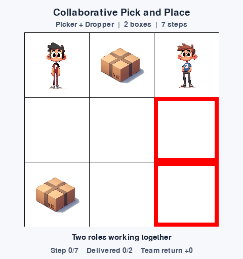

# Collaborative Pick and Place

**A cooperative grid-world for multi-agent reinforcement learning research.**

<p align="center">
  
  <br />
  <em>A scripted successful episode: two complementary roles, two boxes, seven joint actions.</em>
  <br />
  <a href="docs/successful-episode.mp4">Watch / download MP4</a> · <a href="examples/record_demo.py">Reproduce the demo</a>
</p>

[Installation](#installation) · [Quick start](#quick-start) · [Task definition](#task-definition) · [Observations](#observations) · [Reproducible experiments](#reproducible-experiments) · [Development](#development) · [Citation](#citation)

## Research motivation

The task requires agents with complementary capabilities to coordinate **where to move, where to meet, and when to transfer an object**. Pickers collect boxes; droppers deliver them. Neither role can complete a fresh task alone.

Absolute positions, roles and object ownership are observable. This makes the environment useful for studying spatial representations, joint action selection, role specialization and credit assignment under a shared team reward. It is fully observable by default: each agent sees the whole grid state, with itself identified separately. Partial observability and explicit communication are not implemented.

The environment is a compact research testbed. The included tabular and DQN agents are centralized examples, not tuned or empirically validated MARL baselines. The animation uses a scripted policy, not a trained agent.

## Installation

Python **3.10+** is required. CI is configured for Python 3.10–3.12.

```sh
git clone https://github.com/gmontana/CollaborativePickAndPlaceEnv
cd CollaborativePickAndPlaceEnv
python -m venv .venv
source .venv/bin/activate
python -m pip install -e .
```

Core dependencies are Gymnasium, NumPy and Pygame. Training does not require a display. Optional dependencies:

```sh
python -m pip install -e '.[test]'    # pytest
python -m pip install -e '.[video]'   # GIF / MP4 export and demo generation
python -m pip install -e '.[agents]'  # PyTorch and Weights & Biases for the DQN example
```

## Quick start

```python
import gymnasium as gym
import macpp  # registers the environments

env = gym.make("macpp-3x3-2a-1p-2o-v0", max_episode_steps=200)
obs, info = env.reset(seed=42)
env.action_space.seed(42)  # action sampling has its own RNG

try:
    while True:
        actions = env.action_space.sample()
        obs, reward, terminated, truncated, info = env.step(actions)
        if terminated or truncated:
            break
finally:
    env.close()
```

`reward` is the sum of this step's rewards across agents. `terminated` means all boxes have been delivered; `truncated` means a wrapper's time limit was reached. The base environment has no time limit and returns `truncated=False`. `info` is currently empty. Call `reset()` before stepping again after termination.

### Available configurations

```text
macpp-{width}x{height}-{n_agents}a-{n_pickers}p-{n_objects}o-v0
```

Registered grids are 3×3, 5×5, 10×10, 15×15 and 20×20, with 2 or 4 agents, 1–3 pickers, and 1–4 objects. Only combinations with at least one picker, at least one dropper, and sufficient grid capacity are registered. For example, `macpp-5x5-4a-2p-3o-v0` has two agents of each role and three boxes.

For a custom configuration, construct the class directly:

```python
from macpp.core.environment import MACPPEnv

env = MACPPEnv(grid_size=(8, 6), n_agents=3, n_pickers=1, n_objects=2, seed=42)
```

Random initialization assigns distinct cells to all agents, boxes and goals, requiring `width * height >= n_agents + 2 * n_objects`. `n_objects=None` means one object per agent. Every configuration requires at least one object and one goal per object.

### Migrating from the original Gym API

Version 0.1.0 uses **Gymnasium only**. The Python class remains `MACPPEnv`, and valid environment IDs keep their existing names. Existing scripts need these changes:

| Previously | Now |
| --- | --- |
| `import gym` | `import gymnasium as gym` |
| `obs, reward, done, info = env.step(actions)` | `obs, reward, terminated, truncated, info = env.step(actions)` |
| End an episode when `done` | End when `terminated or truncated` |
| `carrying_object is None` in observations | `carrying_object == -1` |
| Boolean role flags and lists of entities in observations | 0/1 role flags and tuples of entities |
| Call `env.render()` to open a window | Set `render_mode="human"` when constructing the environment |
| `env.reset(seed)` | `env.reset(seed=seed)` |
| Default cell size of 300 pixels | Default cell size of 100 pixels; pass `cell_size=300` to retain the old size |

`reset()` still returns `(obs, info)`. Global `initial_state` inputs still accept `None` for empty hands. For value learning, bootstrap after an external time-limit truncation but not after task termination; this distinction is why the step API separates the two flags ([API rationale](https://farama.org/Gymnasium-Terminated-Truncated-Step-API)). Python 3.10+ is required.

The fixes intentionally reject malformed actions and inconsistent custom states, prevent picking up delivered boxes, and prevent stepping a completed episode. Seeded layouts now follow one local RNG; they are not expected to reproduce layouts from the previously broken seeding implementation. Configurations that could never fit their starting entities are no longer registered.

## Task definition

Coordinates are `(x, y)`, starting at `(0, 0)` in the top-left corner. `x` increases rightward and `y` downward. Agents and objects have stable integer identities within an episode; agent roles are randomized on random reset.

### Actions

`action_space` is `MultiDiscrete([6] * n_agents)`. Supply exactly one integer per agent in agent-index order.

| Action | Integer | Effect |
| --- | ---: | --- |
| `UP` | 0 | Move one cell upward |
| `DOWN` | 1 | Move one cell downward |
| `LEFT` | 2 | Move one cell left |
| `RIGHT` | 3 | Move one cell right |
| `PASS` | 4 | Offer or receive a box |
| `WAIT` | 5 | Remain in place |

Pickup and delivery are automatic; they are not separate actions. Both the giver **and** receiver must select `PASS` in the same step. `[4, 5]` does not transfer a box.

### Transition rules

Each joint step resolves in this order:

1. Every agent receives the step penalty.
2. Moves resolve sequentially, from agent 0 upward. Occupied agent cells block movement. Swaps are blocked; moving into a cell already vacated by an earlier agent is allowed. A move beyond the boundary stays at the boundary. A carrying agent cannot enter another box's cell. Empty-handed agents may stand on boxes.
3. Droppers carrying a box on an unfilled goal deliver it.
4. Empty-handed pickers collect an undelivered box at their position, including after `WAIT` or a blocked move.
5. Valid passes are selected. Agents must be orthogonally adjacent; the receiver must have empty hands and no box at its position. Picker-to-dropper passes take priority, then ties follow giver index and receiver index. Matching is greedy; each agent participates at most once per step. A box cannot travel through a chain of agents within one step.
6. Drops resolve again, allowing a dropper to receive and deliver a box on a goal in the same step.
7. The episode terminates once every box is uncarried on a distinct goal, and each agent receives the completion bonus once.

A picker can collect and pass in the same step if it chooses `PASS` while standing on an undelivered box. Agents carry at most one box. Any box can fill any goal. **Delivered boxes stay on their goals and cannot be picked up again.** A carried box on a goal does not count as delivered. Filled goals turn green; unfilled goals are red.

Movement and pass tie-breaking favor lower agent indices. Random layouts are checked for valid placement, not guaranteed solvability; narrow or congested custom layouts may be unsolvable. Record and control layouts when comparing policies.

### Rewards

All rewards are added to the shared scalar returned by `step()`.

| Event | Reward allocation |
| --- | --- |
| Every step | −1 to **each** agent |
| Pickup | +10 to the picker |
| Delivery | +10 to the dropper |
| Picker → dropper pass | +5 to **each participant** |
| Dropper → picker pass | −5 to **each participant** |
| Pass between agents of the same role | No additional reward |
| All boxes delivered | +50 to **each** agent, on the terminal step only |

An otherwise uneventful step with two agents returns −2; a picker-to-dropper pass returns +8. The demo's seven-step episode returns +146 in total.

## Observations

Each agent receives a full-state dictionary with the following structure. All positions are absolute. The `agents` tuple lists the other agents in index order, excluding `self`; objects are ordered by ID. Lists of entities are represented by fixed-length tuples to match the declared Gymnasium spaces.

```python
{
    "agent_0": {
        "self": {"position": (0, 0), "picker": 1, "carrying_object": -1},
        "agents": ({"position": (2, 0), "picker": 0, "carrying_object": 0},),
        "objects": ({"id": 0, "position": (2, 0)},),
        "goals": ((2, 2),),
    },
    "agent_1": {...},
}
```

`picker` is 1 for a picker and 0 for a dropper. `carrying_object` is an object ID or **−1 for empty hands**. Carried objects remain in `objects`, with positions matching their carriers. Goal fulfillment can be inferred from object positions and ownership. Returned observations do not expose mutable internal state.

The nested dictionary is not a ready-to-use tensor for every learning library. The DQN example includes absolute-position, relative-distance and grid encodings. The latter two omit some ownership or role information, so they should not be assumed to preserve the full Markov state. Its centralized joint-action network has `6 ** n_agents` outputs and is intended for small configurations.

## Reproducible experiments

Use `reset(seed=...)` to reproduce layouts and role assignments; subsequent unseeded resets advance the environment's own RNG. Seed action sampling separately, and seed your learning library and exploration strategy as well. The environment does not mutate Python's or NumPy's global RNG state.

For a fixed scenario, use the global `initial_state` format below. This is distinct from the per-agent observations returned by `reset()`:

```python
from macpp.core.environment import MACPPEnv

state = {
    "agents": {
        "agent_0": {"position": (0, 0), "picker": True, "carrying_object": None},
        "agent_1": {"position": (2, 0), "picker": False, "carrying_object": None},
    },
    "objects": [{"id": 0, "position": (1, 0)}],
    "goals": [(2, 1)],
}
env = MACPPEnv((3, 3), n_agents=2, n_pickers=1, n_objects=1, initial_state=state)
```

The constructor checks counts, bounds, unique positions and IDs, role counts and ownership. A carried object's position must match its carrier. Empty hands accept `None` or −1 in this input format. Resetting restores the supplied state. An uncarried box already on a goal is treated as delivered.

In publications and experiment logs, report the repository commit, environment configuration, seeds, horizon, observation encoding, reward changes, and whether policies are centralized or decentralized. Report success rate, steps to completion and return across multiple seeds; return alone is affected by reward shaping. Distinguish time-limit truncation from task termination when bootstrapping value estimates.

## Rendering and demo

With Gymnasium, use `render_mode="human"` for a Pygame window, or `render_mode="rgb_array"` and `env.render()` for a NumPy `uint8` array of shape `(height, width, 3)`. Choose the mode when constructing the environment. The Gymnasium default cell size is 100 pixels and can be overridden with `cell_size=...`.

```sh
python interactive.py
```

In interactive mode, arrow keys move, Space selects `PASS`, and P selects `WAIT`. Input alternates between the two agents, and the environment advances after both actions are selected. Press Space for both agents to coordinate a pass.

To regenerate the README animation and video:

```sh
python -m pip install -e '.[video]'
python examples/record_demo.py
```

The script verifies success and saves both files under `docs/`. It works without a display. To record your own episode, construct an environment with `create_video=True`, step it, then call `env.save_video("episode.mp4")`. Frames are kept in memory for the current episode and cleared on reset; save before resetting.

## Development

```sh
python -m pip install -e '.[test,video]'
python -m pytest -q
```

Tests cover movement and collision ordering, coordinated passes, role restrictions, reward accounting, terminal behavior, deterministic reset, state validation, observation-space containment, all registered configurations, random-rollout invariants, rendering and the successful demo. Tabular-agent tests run with core dependencies; DQN tests run when PyTorch is installed; MP4 export tests run with the video extra. CI installs both optional test dependencies.

For linting and distribution builds:

```sh
python -m pip install ruff build
ruff check .
python -m build
```

CI checks the source and installs the wheel outside the checkout to verify that rendering icons are included. When proposing a rule change, add a small deterministic scenario describing its effect on transitions and rewards. Keep research variants explicit and avoid silently changing an established benchmark's defaults.

### Possible next research version

These are proposals, not current features:

- **Local or occluded observations**, with optional relative-position encodings, to study spatial inference and communication.
- **Bottlenecks and obstacles**, with solvable scenario generation, to require rendezvous planning and coordinated routing.
- **Timed or jointly operated delivery stations**, to make successful completion depend on synchronization beyond a single handoff.

A compatible extension should leave the existing interface, spaces, rewards and deterministic transitions unchanged unless explicitly enabled. New observation/action schemas should use separate environment IDs or wrappers. Freeze representative seeded trajectories as compatibility tests before introducing those variants.

## Citation

If you use this environment in research, cite the software using [CITATION.cff](CITATION.cff) and record the exact commit used.

## License and contact

Released under the [MIT License](LICENCE). Questions and research collaborations: Giovanni Montana, [g.montana@warwick.ac.uk](mailto:g.montana@warwick.ac.uk).
