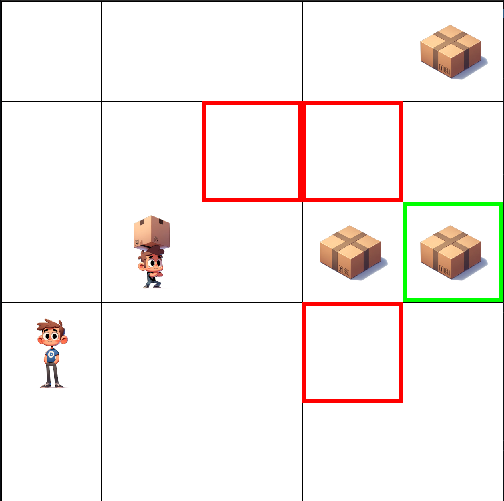

<p align="center">
  <strong>Collaborative Pick and Place</strong>
</p>

<p align="center">
  
</p>

<p align="center">
  A multi-agent reinforcement learning environment
</p>


<!-- TABLE OF CONTENTS -->
<h1> Table of Contents </h1>

- [Overview](#overview)
- [Getting Started](#getting-started)
  - [Installation](#installation)
  - [Interactive](#interactive)
- [Usage](#usage)
  - [Action Space](#action-space)
  - [Observation Space](#observation-space)
  - [Rewards](#rewards)
- [Please Cite](#please-cite)
- [Contributing](#contributing)
- [Contact](#contact)

<!-- OVERVIEW -->

# Overview

This project simulates a scenario where multiple agents collaborate in a task-oriented environment. Agents are designed with different abilities, making them heterogeneous: some can only pick up objects, while others are responsible for placing these objects in specified goal locations.

### Agent Roles

Within this environment, agents fall into two distinct categories:

- **Pickers**: These specialized agents have the unique ability to automatically collect boxes while navigating the grid. However, they are unable to place the boxes into goal positions.

- **Droppers**: In contrast, the non-picker agents, referred to as "Droppers," possess the skill of depositing boxes into goal positions once they reach them. However, they cannot pick up boxes from the grid.

### Actions

Agents have several actions at their disposal:

- **Movements**: They can move in any of the four cardinal directions—UP, DOWN, LEFT, and RIGHT—allowing them to traverse the grid efficiently.

- **WAIT**: Agents can choose to remain in their current position if it's strategically advantageous.

- **Collaboration**: Agents can work together by employing the "PASS" action, enabling them to transfer boxes between one another. This collaborative approach can be essential for success.

### Objective

Agents receive rewards for successfully placing boxes into goal positions. The ultimate task is considered complete when all boxes are placed in their designated goal positions.

### Key Requirement

To tackle this challenge, it's crucial to have at least one Picker agent in your team. 


<!-- GETTING STARTED -->
# Getting Started

## Installation

You can install the Collaborative Pick and Place environment using pip:

```sh
pip install collaborative-pick-place

```
Or to ensure that you have the latest version:
```sh
git clone https://github.com/gmontana/collaborative_pick_and_place
cd collaborative_pick_and_place
pip install -e .
```

<!-- INTERACTIVE -->

## Interactive

An interactive mode is available to manually control a two-agent game.

<!-- USAGE EXAMPLES -->
# Usage

Create environments with the gym framework.
First import
```python
import macpp
```

Then create an environment:
```python
env = gym.make("macpp-3x3-2a-1p-2o-v0")
```

We offer a variety of environments using this template:
```
macpp-{grid_size[0]}x{grid_size[1]}-{n_agents}a-{n_pickers}p-{n_objects}o-v0
```

However you can register your own variation using different parameters:
```python
from gym.envs.registration register

env_name = f"macpp-{grid_size[0]}x{grid_size[1]}-{n_agents}a-{n_pickers}p-{n_objects}o-v0"
    register(
        id=env_name,
        entry_point='macpp.core.environment:MACPPEnv',
        kwargs={
            'grid_size': grid_size,
            'n_agents': n_agents,
            'n_pickers': n_pickers,
            'n_objects': n_objects
        }
    )

```

Similarly to Gym, but adapted to multi-agent settings step() function is defined as
```python
nobs, nreward, ndone, ninfo = env.step(actions)
```

Where n-obs, n-rewards, n-done and n-info are LISTS of N items (where N is the number of agents). The i'th element of each list should be assigned to the i'th agent.

## Observation Space

The observation space for the environment is structured as a dictionary where each agent in the environment has its own observation. Each agent's observation is itself a dictionary with the following keys:

`self`: this key maps to a dictionary that describes the observing agent's own state:
- `position`: a tuple representing the 2D position on the grid
- `picker`: a boolean value indicating if the agent is a picker (can pick up objects) or not
- `carryin_object`: either an integer ID representing the object the agent is currently carrying or `None` if the agent isn't carrying any object

`agents`: this key maps to a list of dictionaries. Each dictionary in this list represents the state of another agent in the environment (excluding the observing agent itself). Each dictionary contains the same fields, i.e. `position`, `picker`, and `carryin_object`.

`objects`: this key maps to a list of dictionaries. Each dictionary in this list represents an object in the environment. Each dictionary contains:
- `id`: an integer representing the unique ID of the object
- `position`: a tuple representing the object's position on the grid

`goals`: This key maps to a list of tuples. Each tuple in this list represents the 2D position of a goal on the grid

Here is a representation of this structure:

```python
{
    'agent_0': {
        'self': {
            'position': (x, y),
            'picker': True/False,
            'carrying_object': ID/None
        },
        'agents': [
            {
                'position': (x, y),
                'picker': True/False,
                'carrying_object': ID/None
            },
            ... (other agents)
        ],
        'objects': [
            {
                'id': ID,
                'position': (x, y)
            },
            ... (other objects)
        ],
        'goals': [
            (x, y),
            ... (other goals)
        ]
    },
    'agent_1': { ... },
    ... (other agents)
}

```


## Action space

actions is a LIST of N INTEGERS (one of each agent) that should be executed in that step. The integers should correspond to the Enum below:

```python
class Action(Enum):
    UP = 0
    DOWN = 1
    LEFT = 2
    RIGHT = 3
    PASS = 4
    WAIT = 5
```
Valid actions can always be sampled like in a gym environment, using:
```python
env.action_space.sample() # [2, 3, 0, 1]
```
Also, ALL actions are valid. If an agent cannot move to a location or load, his action will be replaced with `NONE` automatically.

## Rewards

The followsing rewards can be assigned to the agents:

```python
REWARD_STEP = -1
REWARD_GOOD_PASS = 2
REWARD_BAD_PASS = -2
REWARD_DROP = 10
REWARD_PICKUP = 5
REWARD_COMPLETION = 20
```

<!-- CITATION -->
# Please Cite
The paper that first uses this implementation of the CPP anvironment:
```
paper_here
```

<!-- CONTRIBUTING -->
# Contributing

Contributions are welcome! If you have ideas for new features, improvements, or bug fixes, feel free to fork the repository, make your changes, and submit a pull request.

<!-- CONTACT -->
# Contact

For questions, suggestions, or collaborations, please contact Giovanni Montana at g.montana@warwick.ac.uk.

